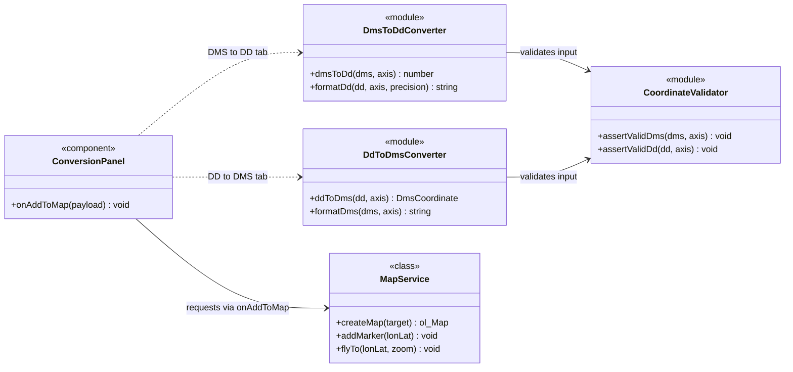

# CoordPoint — Konversi Koordinat DMS ⇄ DD

Aplikasi pemetaan berbasis **React + TypeScript + OpenLayers** untuk mengubah
format koordinat geografis dari **DMS (Degree, Minutes, Seconds)** menjadi
**DD (Decimal Degrees)** dan sebaliknya, lengkap dengan integrasi peta
OpenStreetMap, marker interaktif, unit test Jest, serta dokumentasi perancangan.

> Landing page memperkenalkan proyek, menampilkan dokumentasi class & sequence
> diagram, dan terhubung langsung ke aplikasi peta melalui tombol **"Buka Peta"**.

---

## ✨ Fitur

| Fitur | Deskripsi |
| --- | --- |
| 🗺️ **Peta OpenStreetMap** | Tile OSM dirender dengan library [OpenLayers 10](https://openlayers.org/) |
| 🔁 **DMS → DD** | Input derajat, menit, detik + arah (N/S, E/W) → hasil desimal dengan satuan arah, mis. `49.50278° N` |
| 🔁 **DD → DMS** | Input derajat desimal → hasil `49°30'10.01" N` (sistem tab: pilih arah konversi) |
| 📍 **Add To Maps** | Menambahkan marker/point pada peta dan memusatkan (center) peta dengan animasi halus |
| ✅ **Validasi ketat** | Latitude 0–90°, longitude 0–180°, menit/detik 0–59, arah wajib sesuai axis, pesan error berbahasa Indonesia |
| 🧪 **Unit Test Jest** | 40 test case untuk seluruh fungsi konversi, format, validasi, dan round-trip |
| 🧾 **JSDoc** | Seluruh fungsi pada library terdokumentasi mengikuti standar [JSDoc](https://jsdoc.app/about-getting-started) |
| 📐 **Dokumentasi perancangan** | Class diagram & sequence diagram (Mermaid) pada landing page dan folder `docs/` |

---

## 🛠️ Tech Stack

- **React 19 + TypeScript 5** (Next.js 16 App Router)
- **Tailwind CSS 4** + komponen **shadcn/ui**
- **OpenLayers 10** (map engine) + tile **OpenStreetMap**
- **Jest 30** untuk unit testing
- **Mermaid** untuk rendering diagram dokumentasi
- **ESLint** (config `eslint-config-next`) untuk clean code

---

## 🚀 Instalasi & Menjalankan

### Prasyarat

- **Node.js ≥ 18** (atau [Bun](https://bun.sh) ≥ 1.1)
- Git

### Langkah Instalasi

```bash
# 1. Clone repository
git clone <URL_REPOSITORY_ANDA>.git
cd coordpoint

# 2. Install dependency
npm install
# atau bila menggunakan bun:
# bun install

# 3. Jalankan development server
npm run dev
# atau: bun run dev

# 4. Buka browser
# http://localhost:3000
```

Halaman pertama yang tampil adalah **landing page**. Klik tombol
**"Buka Peta"** (di navbar, hero, maupun CTA bawah) untuk masuk ke
aplikasi peta utama.

### Menjalankan Unit Test (Jest)

```bash
npm run test
# watch mode:
npm run test:watch
```

Output yang diharapkan:

```
Test Suites: 4 passed, 4 total
Tests:       40 passed, 40 total
```

Cakupan pengujian (`src/__tests__/`):

| File | Cakupan |
| --- | --- |
| `dms-to-dd.test.ts` | Konversi DMS→DD (positif/negatif arah, batas, error) |
| `dd-to-dms.test.ts` | Konversi DD→DMS (pembulatan detik, carry 60", batas ±90/±180) |
| `format.test.ts` | Format keluaran `49.50278° N` dan `49°30'10.01" N` |
| `roundtrip.test.ts` | Invariansi `dmsToDd(ddToDms(x)) ≈ x` |

### Build Produksi

```bash
npm run build
npm run start
```

---

## 📂 Struktur Folder

```
coordpoint/
├── docs/
│   ├── class-diagram.md          # Class diagram (Mermaid) + penjelasan relasi
│   └── sequence-diagram.md       # Sequence diagram (Mermaid) alur aplikasi
├── src/
│   ├── app/
│   │   ├── layout.tsx            # Root layout (font, metadata, Toaster)
│   │   ├── page.tsx              # Entry: LandingPage ⇄ MapWorkspace
│   │   └── globals.css           # Tailwind 4 + theme + utilitas scrollbar
│   ├── components/
│   │   ├── docs/
│   │   │   └── MermaidDiagram.tsx  # Renderer Mermaid (lazy import)
│   │   ├── landing/
│   │   │   └── LandingPage.tsx     # Landing page (hero, fitur, dokumentasi)
│   │   ├── map/                    # Komponen aplikasi peta (reusable)
│   │   │   ├── MapWorkspace.tsx    # Shell aplikasi: header + peta + panel
│   │   │   ├── MapCanvas.tsx       # Container render OpenLayers
│   │   │   ├── ConversionPanel.tsx # Form konversi DMS⇄DD + Add To Maps
│   │   │   └── FloatingButton.tsx  # Tombol mengambang pembuka panel
│   │   └── ui/                     # Komponen shadcn/ui
│   ├── lib/
│   │   ├── coordinates/            # ⭐ Library konversi murni (testable)
│   │   │   ├── types.ts            #   Tipe & CoordinateValidationError
│   │   │   ├── validate.ts         #   assertValidDms / assertValidDd
│   │   │   ├── dms-to-dd.ts        #   dmsToDd / formatDd
│   │   │   ├── dd-to-dms.ts        #   ddToDms / formatDms
│   │   │   └── index.ts            #   Barrel export
│   │   ├── docs/
│   │   │   └── diagrams.ts         # Sumber Mermaid untuk landing page
│   │   └── ol/
│   │       └── map-service.ts      # MapService (jembatan React ↔ OpenLayers)
│   └── __tests__/                  # Unit test Jest
├── jest.config.ts
└── README.md
```

Komponen dipisah per-tanggung-jawab (**reusable & mudah dibaca**):
library konversi sengaja *pure* (tanpa React/DOM) agar mudah diuji,
sedangkan seluruh interaksi OpenLayers dibungkus satu class `MapService`.

---

## 📐 Dokumentasi Perancangan

Dokumentasi perancangan melengkapi activity diagram & component diagram yang
sudah ada dengan **class diagram** dan **sequence diagram**:

- [`docs/class-diagram.md`](docs/class-diagram.md) — relasi class/function
- [`docs/sequence-diagram.md`](docs/sequence-diagram.md) — life cycle proses konversi → Add To Maps

Keduanya juga dirender interaktif pada landing page, bagian **Dokumentasi**.

### Class Diagram (ringkas)



---

## 🧭 Cara Menggunakan Aplikasi

1. Dari landing page, tekan **Buka Peta**.
2. Peta OpenStreetMap terbuka dengan tombol mengambang biru di kanan atas
   (tepat di bawah readout koordinat).
3. Tekan tombol tersebut → panel **Konversi Koordinat** muncul.
4. Pilih tab:
   - **DMS to DD** → isi Derajat/Menit/Detik + arah N/S & E/W → **Konversi ke DD**.
   - **DD to DMS** → isi derajat desimal (negatif = S/W) → **Konversi ke DMS**.
5. Hasil ditampilkan dengan satuan arah, mis. `49.50278° N` atau `49°30'10.01" N`.
6. Tekan **Add To Maps** → marker muncul dan peta berpusat ke titik tersebut.

---

## 🧹 Clean Code

- **TypeScript strict** — tanpa `any`, tipe eksplisit untuk semua API publik.
- **JSDoc** — seluruh fungsi library & service terdokumentasi (`@param`, `@returns`, `@throws`, `@example`).
- **ESLint** — `npm run lint` bersih tanpa error/warning.
- **Pure functions** — library konversi tidak bergantung React/DOM sehingga 100% ter-cover unit test.
- **Komponen kecil & fokus** — satu tanggung jawab per komponen (`MapCanvas`, `FloatingButton`, `ConversionPanel`).

---

## 📄 Lisensi

Data peta © [OpenStreetMap contributors](https://www.openstreetmap.org/copyright).
