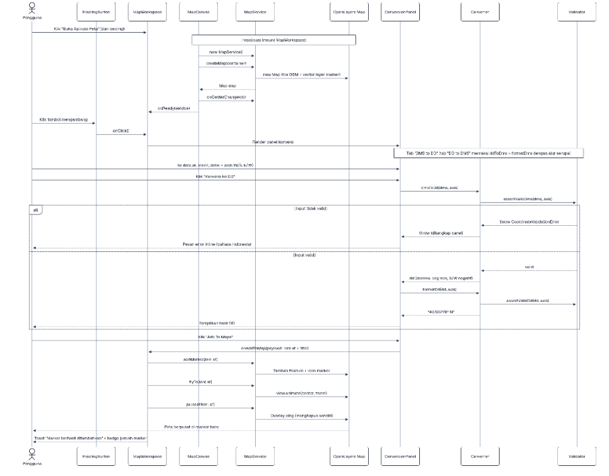

# CoordPoint — Konversi Koordinat DMS ⇄ DD & Peta Geodesi

Aplikasi web modern berbasis **Next.js 16 (React 19) + TypeScript + OpenLayers** untuk melakukan konversi presisi tinggi dari koordinat **DMS (Degree, Minutes, Seconds)** ke **DD (Decimal Degrees)** dan sebaliknya, dilengkapi visualisasi peta OpenStreetMap, 3D modelling bumi interaktif, unit test Jest 100% lulus, dan standar dokumentasi JSDoc.

---

## 1. VERSI RINGKAS (QUICK START GUIDE)

Petunjuk praktis untuk pengguna yang ingin langsung mencoba aplikasi dan pengujian:

* **1. Clone & Masuk Folder**: `git clone <repo-url> && cd coordpoint`
* **2. Install Dependencies**: `npm install` (atau `bun install`)
* **3. Jalankan Dev Server**: `npm run dev` → Akses `http://localhost:3000`
* **4. Jalankan Unit Test (Jest)**: `npm test` (40/40 test case lulus)
* **5. Jalankan Type Check & Lint**: `npx tsc --noEmit` & `npx eslint .`
* **6. Build Produksi**: `npx next build`

---

## 2. PANDUAN LENGKAP & DETAIL

---

### Prasyarat Sistem

Sebelum memulai instalasi, pastikan lingkungan sistem Anda memenuhi spesifikasi berikut:

* **Node.js**: `v18.17.0` atau versi lebih baru (Direkomendasikan Node.js LTS `v20.x`).
* **Package Manager**: `npm` (`v9.x` atau lebih baru) atau `bun` (`v1.1.x`).
* **Git**: `v2.x` untuk melakukan pengklonaan repositori.
* **Browser**: Browser modern yang mendukung WebGL 2.0 (Google Chrome, Mozilla Firefox, Microsoft Edge, Safari).

---

### Langkah Instalasi & Pengoperasian

#### 1. Kloning Repositori
Buka terminal shell dan jalankan perintah:
```bash
git clone https://github.com/arofandestama/coordpoint-web.git
cd coordpoint
```

#### 2. Instalasi Dependensi
Instal seluruh modul dependensi yang dibutuhkan:
```bash
npm install
```

#### 3. Menjalankan Server Pengkodingan (Development Server)
Jalankan server lokal Next.js dengan perintah:
```bash
npm run dev
```
Buka browser Anda dan navigasikan ke `http://localhost:3000`.

---

### Panduan Lengkap Pengujian (Unit Testing)

Aplikasi CoordPoint dilengkapi dengan pengujian unit komprehensif menggunakan **Jest 30** + **jsdom** yang mencakup 40 kasus uji matematis geodesi. Setiap berkas uji *colocated* di samping modul yang diuji (mis. `src/utils/coordinates/dmsToDd.test.ts`).

#### Menjalankan Test Suite
Untuk mengeksekusi pengujian otomatis, jalankan:
```bash
npm test
```

#### Menjalankan Mode Pantau (Watch Mode)
Untuk pengkodingan interaktif dan mengeksekusi tes setiap kali ada perubahan berkas:
```bash
npm run test:watch
```

#### Hasil Pengujian yang Diharapkan
```text
PASS src/utils/coordinates/ddToDms.test.ts
PASS src/utils/coordinates/dmsToDd.test.ts
PASS src/utils/coordinates/format.test.ts
PASS src/utils/coordinates/roundtrip.test.ts

Test Suites: 4 passed, 4 total
Tests:       40 passed, 40 total
Snapshots:   0 total
Time:        0.727 s
```

#### Rincian Cakupan Berkas Pengujian (`src/__tests__/`)

| Berkas Pengujian | Fungsi Utama | Kasus Uji (Test Cases) |
| :--- | :--- | :--- |
| `dmsToDd.test.ts` | Transformasi DMS ke Decimal Degrees | Pengujian arah N/S/E/W, batas max lat ±90° & lon ±180°, serta penanganan throw error validasi. |
| `ddToDms.test.ts` | Transformasi Decimal Degrees ke DMS | Pengujian perataan detik, carry-over 60" ke menit dan derajat, serta penanganan nilai negatif. |
| `format.test.ts` | Standar Format Output | Pengujian keluaran teks human-readable seperti `49.50278° N` dan `49°30'10.01" N`. |
| `roundtrip.test.ts` | Invariansi Matematis (Round-trip) | Pengujian bahwa `dmsToDd(ddToDms(x))` mengembalikan koordinat `x` yang presisi tanpa distorsi. |

---

### Standar Clean Code & JSDoc Documentation

Aplikasi ini menggunakan standar penulisan **Clean Code TypeScript React** dan dokumentasi **JSDoc resmi** ([https://jsdoc.app/about-getting-started](https://jsdoc.app/about-getting-started)):

* **JSDoc Annotations**: Seluruh fungsi dan komponen menggunakan tag `@module`, `@function`, `@component`, `@param`, `@returns`, `@throws`, dan `@example`.
* **ESLint Compliance**: Bebas dari tipe `any`, mematuhi aturan strict mode React, dan lulus pengujian `npx eslint .`.
* **Desain Tampilan**: Scrollbar disembunyikan secara bersih di seluruh browser (`::-webkit-scrollbar { display: none; }`) tanpa mengganggu fungsi scroll.

---

### Best Practices Optimasi Performa 3D WebGL (Earth Modeling)

Untuk memastikan pengolahan grafik 3D di browser berjalan sangat cepat tanpa mengalami **Input Delay** (~453ms):

1. **Kompresi Asset 3D (`.glb`)**:
   - Model `earth.glb` berukuran **58.5 MB** dapat dikompresi menggunakan **Draco Mesh Compression** (`gltf-pipeline -i earth.glb -o earth-draco.glb -d`) untuk mengurangi ukuran berkas hingga >90% (< 3 MB).
2. **Pengurangan Draw Calls**:
   - Menghapus elemen dekorasi berat di sekitar globe (misal orbit torus & starfield vertex) sehingga komponen Three.js hanya menjalankan **1 single draw call** yang sangat ringan.
3. **React Memoization**:
   - Membungkus komponen canvas 3D dengan `React.memo` agar Three.js tidak melakukan re-render ulang saat state komponen induk (Landing Page) berubah.
4. **Optimasi Frame Loop & DPR**:
   - Membatasi Device Pixel Ratio ke `dpr={[1, 1.5]}` dan menggunakan opsi WebGL `powerPreference: 'high-performance'` untuk menjamin rotasi 60 FPS pada layar retina.
5. **Non-blocking Event Listener**:
   - Menggunakan `requestAnimationFrame` dan membaca properti `clientWidth`/`clientHeight` sebagai pengganti `getBoundingClientRect()` pada listener `onMouseMove` untuk mencegah *forced synchronous reflow*.

---

### Perintah Utama (Summary Commands)

| Perintah | Deskripsi |
| :--- | :--- |
| `npm run dev` | Menjalankan development server pada `http://localhost:3000` |
| `npm test` | Menjalankan 40 unit test Jest |
| `npm run test:watch` | Menjalankan Jest dalam mode interaktif (watch mode) |
| `npx tsc --noEmit` | Pengecekan validasi tipe TypeScript |
| `npx eslint .` | Pengecekan standar clean code ESLint |
| `npx next build` | Kompilasi build produksi Next.js |


---

## Struktur Folder

```
coordpoint/
├── docs/
│   ├── images/
│   │   ├── class-diagram.png     # Gambar Class Diagram
│   │   └── sequence-diagram.png  # Gambar Sequence Diagram
│   ├── class-diagram.md          # Dokumentasi Class Diagram
│   └── sequence-diagram.md       # Dokumentasi Sequence Diagram
├── src/
│   ├── app/                        # Next.js App Router
│   │   ├── layout.tsx              # Root layout (font, metadata, Toaster)
│   │   ├── page.tsx                # Entry: LandingPage ⇄ MapWorkspace
│   │   └── globals.css             # Tailwind 4 + theme + utilitas scrollbar
│   ├── common/                     # Reusable UI primitives & shared module
│   │   ├── mapService.ts           #   MapService (jembatan React ↔ OpenLayers)
│   │   └── *.tsx                   #   Komponen shadcn/ui (button, input, ...)
│   ├── components/                 # Self-contained component units (PascalCase)
│   │   ├── docs/
│   │   │   └── MermaidDiagram.tsx  #   Renderer Mermaid (lazy import)
│   │   ├── landing/
│   │   │   ├── LandingPage.tsx     #   Landing page (hero, fitur, dokumentasi)
│   │   │   └── EarthGlobe.tsx      #   Model 3D Bumi (React Three Fiber)
│   │   └── map/
│   │       ├── MapWorkspace.tsx    #   Shell aplikasi: header + peta + panel
│   │       ├── MapCanvas.tsx       #   Container render OpenLayers
│   │       ├── ConversionPanel.tsx #   Form konversi DMS⇄DD + Add To Maps
│   │       └── FloatingButton.tsx  #   Tombol mengambang pembuka panel
│   ├── constants/                  # Global constants (*.constants.ts)
│   │   ├── coordinates.constants.ts #  Batas derajat/menit & faktor pembulatan
│   │   ├── mapConfig.constants.ts   #  Center & zoom default peta
│   │   └── diagrams.constants.ts    #  Sumber Mermaid untuk landing page
│   ├── hooks/                      # Reusable hooks (camelCase, prefix `use`)
│   │   ├── useMobile.ts            #   Deteksi viewport mobile
│   │   └── useToast.ts             #   Toast store + hook
│   ├── store/                      # Zustand store (state management)
│   │   ├── map.store.ts            #   Vanilla store (panel & marker)
│   │   └── useMapStore.ts          #   React hook adapter
│   ├── types/                      # Global types & DTOs (*.types.ts)
│   │   ├── coordinate.types.ts     #   Axis, DmsCoordinate, error validasi
│   │   └── geo.types.ts            #   LonLat, CenterChangeHandler, MapMarker
│   └── utils/                      # Pure utilities (+ colocated tests)
│       ├── cn.ts                   #   Penggabung className (clsx + tailwind-merge)
│       └── coordinates/            #   Star Library konversi murni (testable)
│           ├── dmsToDd.ts          #     dmsToDd / formatDd
│           ├── dmsToDd.test.ts     #     Unit test dmsToDd & formatDd
│           ├── ddToDms.ts          #     ddToDms / formatDms
│           ├── ddToDms.test.ts     #     Unit test ddToDms & formatDms
│           ├── validate.ts         #     assertValidDms / assertValidDd
│           ├── format.test.ts      #     Unit test formatDd / formatDms
│           ├── roundtrip.test.ts   #     Unit test invariansi DMS ⇄ DD
│           └── index.ts            #     Barrel export
├── jest.config.ts
└── README.md
```

Struktur di atas mengikuti **Frontend Guidelines** pada `docs/readme.md`:
folder `kebab-case`, file umum `camelCase`, komponen `PascalCase`,
hook `use*` `camelCase`, serta suffix `.types.ts`, `.constants.ts`,
`.store.ts`, dan `.test.ts` dengan unit test *colocated* di samping kodenya.

Komponen dipisah per-tanggung-jawab (**reusable & mudah dibaca**):
library konversi sengaja *pure* (tanpa React/DOM) agar mudah diuji,
sedangkan seluruh interaksi OpenLayers dibungkus satu class `MapService`.

---

## Dokumentasi Perancangan

Dokumentasi perancangan melengkapi activity diagram & component diagram yang
sudah ada dengan **class diagram** dan **sequence diagram**:

- [`docs/class-diagram.md`](docs/class-diagram.md) — relasi class/function
- [`docs/sequence-diagram.md`](docs/sequence-diagram.md) — life cycle proses konversi → Add To Maps

Keduanya juga dirender interaktif pada landing page, bagian **Dokumentasi**.

### Class Diagram


### Sequence Diagram



---

## Cara Menggunakan Aplikasi

1. Dari landing page, tekan **Buka Peta**.
2. Peta OpenStreetMap terbuka dengan tombol mengambang biru di kanan atas
   (tepat di bawah readout koordinat).
3. Tekan tombol tersebut → panel **Konversi Koordinat** muncul.
4. Pilih tab:
   - **DMS to DD** → isi Derajat/Menit/Detik + arah N/S & E/W → **Konversi ke DD**.
   - **DD to DMS** → isi derajat desimal (negatif = S/W) → **Konversi ke DMS**.
5. Hasil ditampilkan dengan satuan arah, mis. `49.50278° N` atau `49°30'10.01" N`.
6. Tekan **Add To Maps** → marker muncul dan peta berpusat ke titik tersebut.

---

## Clean Code

- **TypeScript strict** — tanpa `any`, tipe eksplisit untuk semua API publik.
- **JSDoc** — seluruh fungsi library & service terdokumentasi (`@param`, `@returns`, `@throws`, `@example`).
- **ESLint** — `npm run lint` bersih tanpa error/warning.
- **Pure functions** — library konversi tidak bergantung React/DOM sehingga 100% ter-cover unit test.
- **Komponen kecil & fokus** — satu tanggung jawab per komponen (`MapCanvas`, `FloatingButton`, `ConversionPanel`).

---

## Lisensi

Data peta © [OpenStreetMap contributors](https://www.openstreetmap.org/copyright).
