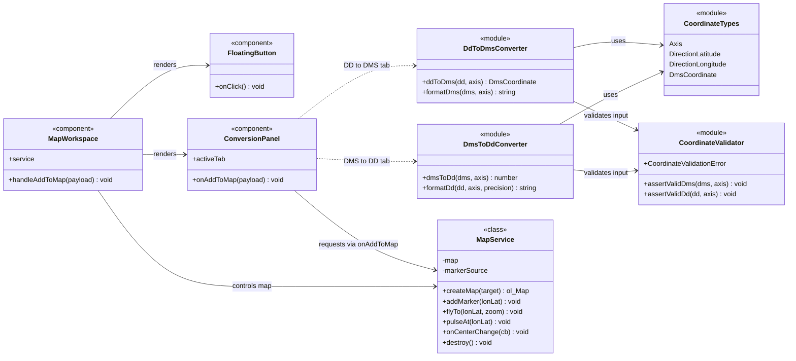

# Class Diagram — CoordPoint

Rencana relasi class/function untuk studi kasus konversi koordinat DMS ⇄ DD.
Diagram ini juga dirender langsung pada landing page (bagian **Dokumentasi**) dan
disimpan sebagai sumber mermaid di `src/lib/docs/diagrams.ts`.

## Diagram

## Penjelasan Relasi

| Sumber | Target | Makna |
| --- | --- | --- |
| `DmsToDdConverter` / `DdToDmsConverter` | `CoordinateTypes` | Menggunakan tipe bersama (`Axis`, `DmsCoordinate`, dsb.) |
| `DmsToDdConverter` / `DdToDmsConverter` | `CoordinateValidator` | Memvalidasi input sebelum konversi; kegagalan melempar `CoordinateValidationError` |
| `ConversionPanel` | `DmsToDdConverter` | Tab **DMS to DD** memanggil `dmsToDd()` + `formatDd()` |
| `ConversionPanel` | `DdToDmsConverter` | Tab **DD to DMS** memanggil `ddToDms()` + `formatDms()` |
| `MapWorkspace` | `MapService` | Mengontrol peta: `createMap`, `addMarker`, `flyTo`, `pulseAt` |
| `MapWorkspace` | `ConversionPanel` / `FloatingButton` | Merender komponen UI dan menghubungkan callback |
| `ConversionPanel` | `MapService` | Request "Add To Maps" dikirim via callback `onAddToMap` |

## Pemetaan ke Struktur Folder

| Simbol pada diagram | Lokasi file |
| --- | --- |
| `CoordinateTypes` | `src/lib/coordinates/types.ts` |
| `CoordinateValidator` | `src/lib/coordinates/validate.ts` |
| `DmsToDdConverter` | `src/lib/coordinates/dms-to-dd.ts` |
| `DdToDmsConverter` | `src/lib/coordinates/dd-to-dms.ts` |
| `MapService` | `src/lib/ol/map-service.ts` |
| `MapWorkspace` | `src/components/map/MapWorkspace.tsx` |
| `ConversionPanel` | `src/components/map/ConversionPanel.tsx` |
| `FloatingButton` | `src/components/map/FloatingButton.tsx` |
