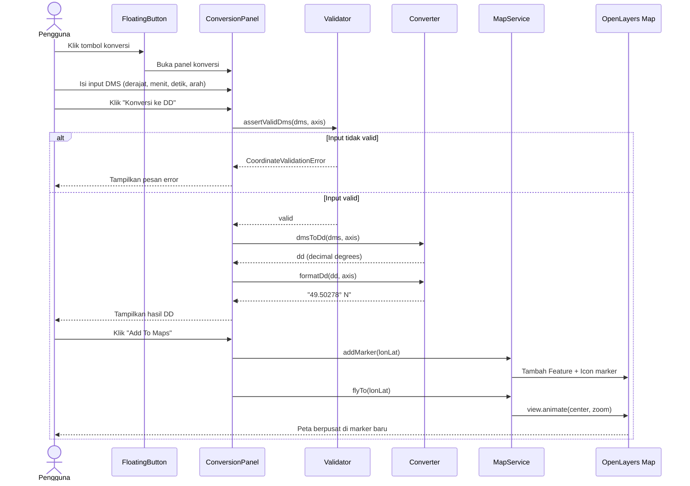

# Sequence Diagram — CoordPoint

Alur (life cycle) proses konversi koordinat dari interaksi pengguna hingga
marker muncul di peta OpenLayers. Diagram ini juga dirender pada landing page
(bagian **Dokumentasi**).

## Skenario: Konversi DMS → DD lalu Add To Maps

## Penjelasan Tahapan

1. **Buka panel** — pengguna menekan floating button; `MapWorkspace` merender `ConversionPanel`.
2. **Input** — pengguna mengisi derajat/menit/detik dan memilih arah (N/S untuk latitude, E/W untuk longitude), atau memilih tab **DD to DMS** dan memasukkan derajat desimal.
3. **Validasi** — `assertValidDms` / `assertValidDd` memastikan rentang angka (latitude 0–90°, longitude 0–180°, menit & detik 0–59). Kegagalan melempar `CoordinateValidationError` yang ditampilkan sebagai pesan error inline.
4. **Konversi & format** — `dmsToDd` menghasilkan decimal degrees (S/W bernilai negatif), `formatDd` membungkusnya dengan arah (`49.50278° N`). Sebaliknya `ddToDms` + `formatDms` menghasilkan `49°30'10.01" N`.
5. **Add To Maps** — `MapService.addMarker()` menambahkan Feature + Icon pada vector layer, `flyTo()` menganimasikan `view.animate()` sehingga peta berpusat pada marker baru, dan `pulseAt()` menampilkan animasi ping singkat.
